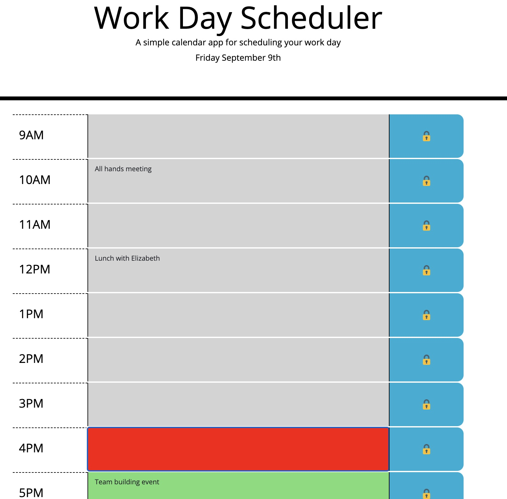

# day-planner

## Introduction
This was a solo project completed for UCB Full Stack Bootcamp 2021. The project was to sreate a simple calendar application that allows a user to save events for each hour of the day. This app features dynamically updated HTML and CSS powered by jQuery.

Visit the [live demo](https://wendyqnguyen.github.io/day-planner/)!

## Built With
* HTML
* CSS
* Javascript
* Moment.js
* Bootstrap

## Screenshot

### Deployment

This application is currently deployed on GitHub.

## Contribution
- Wendy Nguyen - [@linkedln](https://www.linkedin.com/in/wenguyen/)

### ©️2021 Wendy Nguyen 
